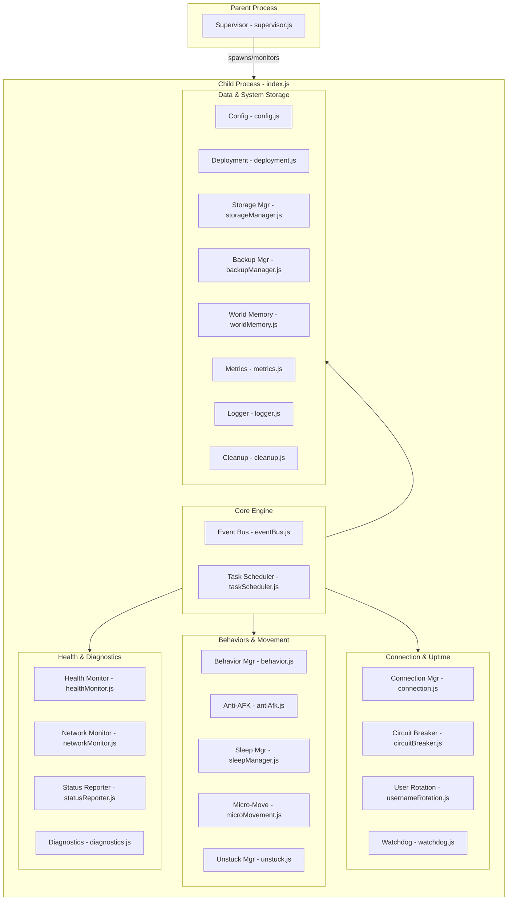

# Autobot

A production-grade, highly resilient, stationary AFK Mineflayer service designed for 24/7 uptime on Minecraft servers (specifically optimized for Aternos). 

## Key Architecture

Autobot uses a decoupled, multi-phase parent-child architecture designed for ultra-low resource footprint and maximum resilience.



## Features

- **Robust Multi-Phase Bootstrapping**: Six-phase startup sequence (Deployment -> Diagnostics -> Storage -> Connection -> Behavior -> Monitoring) with failure aborts.
- **Supervisor-Child Model**: The parent supervisor forks the child process with `--max-old-space-size=256 --expose-gc` and monitors heartbeat pings. If the child freezes or crashes, it is automatically respawned.
- **Health Check HTTP Server**: Exposes a native Node.js HTTP server on port `7860` (or `PORT` env var) reporting bot connection status, heartbeat timestamps, and supervisor uptime. Used to keep the app awake in environments like Hugging Face.
- **Hot-Reloading Configuration**: Automatically monitors `src/config.js` via MD5 hashing every 30 seconds and reloads settings live without breaking the connection.
- **Circuit Breaker Protection**: Dynamically pauses connection attempts for 30 minutes if 20 consecutive attempts fail.
- **Freeze Watchdog**: Monitors socket packet rates and physics tick timings, executing progressive soft/hard reconnects and restarts on freezes.
- **Micro-Movements & Unstuck Logic**: Custom localized steps and jumps (`src/microMovement.js`, `src/unstuck.js`) replace heavy pathfinding engines to maintain zero-idle-CPU footprints.
- **Player-Interactive Sleep Countdown**: Announce sleep plans, count down from 15 in chat, allow players to veto by typing `no`, and pause sleep for 5 minutes if vetoed.
- **Daily Logger & Rotation**: Writes logs to `logs/latest.log` with daily archival and a 30-day retention cleanup routine.
- **Atomic Database Management**: Safe writes using `.tmp` buffers and `.backup` rollbacks to prevent corruption.

## Installation & Setup

1. Clone this repository.
2. Install dependencies:
   ```bash
   npm install
   ```
3. Create a `.env` file in the root directory and specify your server credentials:
   ```env
   MC_SERVER_HOST="your-server-ip.aternos.me"
   MC_SERVER_PORT=12345
   MC_SERVER_VERSION="1.20.4"
   ```
4. Start the bot:
   ```bash
   npm start
   ```

## Configuration

All custom settings can be configured inside [src/config.js](src/config.js):
- **antiAfk**: Interval and actions (rotation, crouching, walking, slot swapping).
- **watchdog**: Packet, tick, and chat timeout thresholds.
- **usernameRotation**: Rotation sequences and account pools.
- **healthMonitor**: Memory limit RSS settings and lag thresholds.
- **behavior**: Chat paragraphs and message intervals.

## Hugging Face Spaces 24/7 Deployment

To run this bot 24/7 for free without any limits:

1. **Create a Space on Hugging Face**:
   - SDK: Choose **Docker**
   - Template: Choose **Blank**
   - Visibility: Public or Private (secrets remain private either way)
2. **Add Environment Variables**:
   - Go to Settings -> Variables and Secrets.
   - Add your Secrets:
     - `MC_SERVER_HOST`
     - `MC_SERVER_PORT`
     - `MC_SERVER_VERSION`
3. **Deploy**:
   - Push this repository to the Hugging Face space remote repository.
4. **Keep Awake 24/7 (Prevent Sleep)**:
   - Go to [UptimeRobot](https://uptimerobot.com/) (free tier).
   - Create a HTTP(s) Monitor pointing to your public Hugging Face space URL:
     `https://<your-username>-<your-space-name>.hf.space/`
   - Set it to ping every 5 minutes. This will prevent the space from ever going to sleep!
